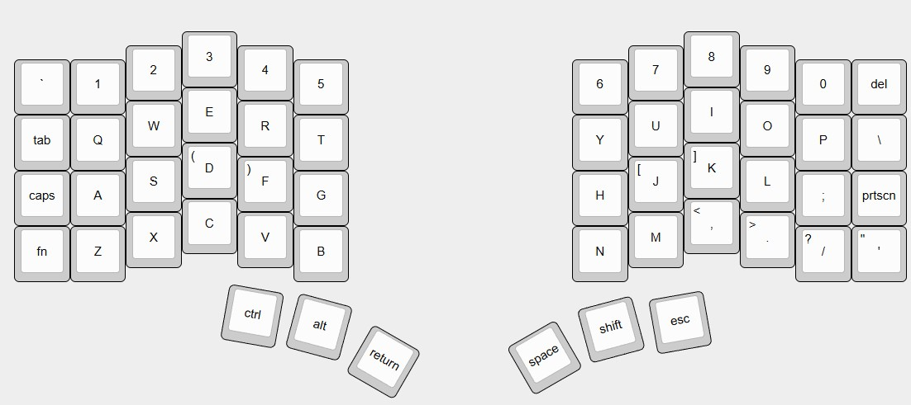

# Split Keyboard

  

This is a fully customizable split mechanical keyboard featuring per-key RGB lighting, dual 2.2″ LCD displays, and complete QMK firmware support.

> **Note:** This project is currently under development. Detailed build instructions and documentation will be provided soon.

## Features

- **Ergonomic Split Layout** – Improves typing comfort and reduces strain.  
- **Dual LCD Displays** – Each half includes a 2.2" LCD for customizable graphics and real-time system information.
- **QMK Firmware** – Fully programmable, with support for layers, macros, and custom keymaps.  
- **Per-Key RGB Lighting** – Individually addressable SK6812 Mini LEDs for lighting effects.  
- **Hot-Swappable Switches** – Easily swap switches without soldering.  

## Specifications

- **Microcontroller**: STM32G474CETx
- **Key Layout**: Split layout with additional keys for layers and macros.
- **Display**: 2.2" LCD (320x240 resolution) per half.
- **Lighting**: SK6812 Mini RGB LEDs.
- **Switches**: Kailh Choc Low Profile.

## Build & Assembly

1. Order the PCBs and have them assembled using the provided BOM and pick-and-place files (e.g., via PCBWay).
2. 3D print the keyboard case components and source all necessary hardware, including LCDs, switches, keycaps, and mounting hardware.
3. Assemble all components, ensuring proper alignment of the PCB, switches, and case.
4. Flash the appropriate firmware onto each half of the keyboard. Note that the left and right halves require separate firmware builds.

## Roadmap
> This section outlines the planned features and improvements for the project. It is a work in progress and will be updated as development continues.

- [ ] Finalize PCB design  
- [ ] Publish detailed step-by-step build guide  
- [ ] Write firmware flashing and setup documentation  
- [ ] Upload STL files for 3D-printable case components  
- [ ] Publish demo and assembly videos  
